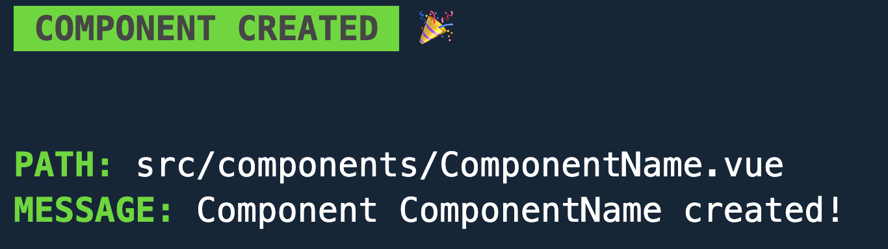

  
# vcreate
vcreate is a small command-line tool that makes it easy to create Vue.js components. It supports the latest Composition API syntax and can insert `lang="scss"` in styles or `lang="ts"` in script tag. Also you can use to create `options api` components.



## List of features
- Easy to use
- Supports latest Composition API syntax
- Supports options api syntax
- Can insert lang="scss" in styles
- Can insert lang="ts" in script tag

## Installation
You can install vcreate using either `npm` or `yarn`.

#### npm
To install vcreate globally using npm, run the following command:
```sh
npm i -g vcreate
```

---
#### yarn
To install vcreate using yarn, run the following command
```sh
yarn add vcreate
```

That's it! You should now have vcreate installed on your system and be ready to start using it. If you encounter any issues during the installation process, please open a [GitHub issue](https://github.com/mrdisa97/vcreate/issues) for help.
## Usage

To use vcreate, simply run the following command in your terminal:
```sh
$ vcreate <command> 'component' [option]
```
List of commands are available down in the documentation

---
To create a Vue.js component using vcreate, simply run the following command:
```sh
vcreate component ComponentName
```
This will create a new component named `ComponentName.vue` in the `components/` directory of your project.

#### Creating a component in a subdirectory
If you want to create a component inside a subdirectory of the `components/` directory, you can use the following syntax:
```sh
vcreate view fname.ComponentName
```
This will create a new directory named `fname` inside the `components/` directory and a new component named `ComponentName.vue` inside the `components/fname/` directory. You can also create multiple subflders by typing `sub1.sub2.sub3.component` etc.

#### Creating a component in the views directory
To create a component in the `views/` directory instead of the `components/` directory, you can use the following command:
```sh
vcreate view ComponentName
```
This will create a new component named `ComponentName.vue` in the `views/` directory of your project.

#### Creating a component in a subdirectory of the views directory
To create a component inside a subdirectory of the `views/` directory, you can use the following syntax:
```sh
vcreate view fname.componentName
```
This will create a new directory named `fname` inside the `views/` directory and a new component named `ComponentName.vue` inside the `views/fname/` directory.

## Options

#### Type
Default type is `Composition API` and it looks like this:
```html
<script setup>
  // Code here
</script>
```
If you want to change type of the component you can add option `--type options` or `-t options` you'll get:
```html
<script>
  export default {
    data() {
      return {
        /* Data options here */
      };
    }
  }
</script>
```

#### Lang
If you want to add lang attribute to your script tag you can use `--lang ts` or `-l ts` for example if you want to add TypeScript language.
```html
<scrypt lang="ts">
</script>
```

#### SCSS
If you want to add scss attribute to your script tag you can use `--scss` and you'll get:
```html
<style lang="scss">
  /* Styles here */
</style>
```

#### Scoped
To add `scoped` attribute to your script tag you can use `--scoped` option, and you'll get:
```html
<style scoped>
  /* Styles here */
</style>
```
---
You can use as many different options as you like.

## List of commands and options

#### List of commands
| Option     | Description                                                           |
| ---------- | --------------------------------------------------------------------- |
| `help`     | Show CLI help                                                         |
| `component`| Make component, required component name after command                 |
| `view`     | Make component in views folder, required component name after command |

#### List of options/flags
| Option     | Alias  | Description                                                                   |
| ---------- | ------ | ----------------------------------------------------------------------------- |
| `--help`   | `-h`   | Show CLI help                                                                 |
| `--version`| `-v`   | Show the version of current CLI                                               |
| `--type`   | `-t`   | Choose scripts type, aviliable options: `composition` (default) and `options` |
| `--lang`   | `-l`   | Lang for the script tag; use `-l ts` to specify TypeScript, for example       |
| `--scss`   |   /    | Use sass in your style tag (`lang="scss"`)                                    |
| `--scoped` |   /    | Add scoped attribute to `<style>` tag                                         |


## How to Contribute
Thank you for your interest in contributing to this project! Your help is essential to making it better.

If you would like to contribute, please follow these steps:

1. Fork the repository and clone it to your local machine.
2. Create a new branch with a descriptive name for your changes: `git checkout -b my-new-feature.`
3. Make your changes and test them thoroughly.
4. Commit your changes: `git commit -am 'Add some feature'`.
5. Push to the branch: git push origin my-new-feature.
6. Open a pull request to the main branch and provide a detailed description of your changes.

We appreciate all contributions, whether they are small bug fixes or major features. If you have any questions or need help getting started, please don't hesitate to reach out to us.

Thank you for your contributions!

## Support me

<a href="https://www.buymeacoffee.com/MrDisa97" target="_blank"></a>
## License
The MIT License (MIT). Please see [License File](LICENSE.md) for more information.